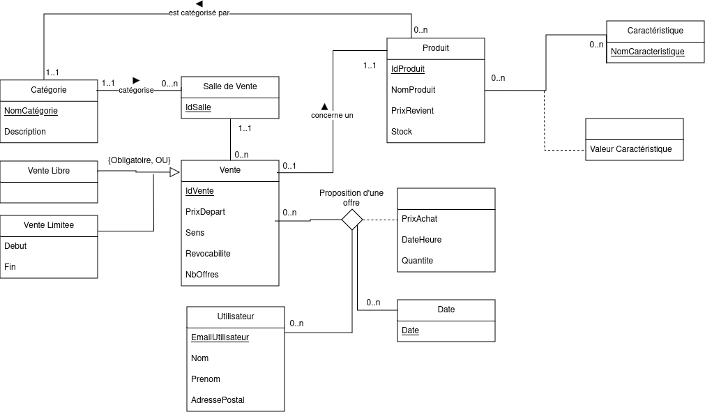

# Plateforme d'enchère

## Dépendences & contraintes

<table>
  <tr>
    <th style="border:1px solid">Dépendances Fonctionnelles</th>
    <th style="border:1px solid">Contraintes de Valeur</th>
    <th style="border:1px solid">Contraintes de Multiplicité</th>
    <th style="border:1px solid">Contraintes Contextuelles</th>
  </tr>
  <tr>
    <td style=" text-align: left; border:1px solid">
     EmailUtilisateur → {Nom, Prenom, AdressePostale}   
     IdProduit → {NomProduit, PrixRevient, Stock , NomCategorie}   
     NomCategorie → DescriptionCategorie   
     {IdProduit, NomCaracteristique} → ValeurCaracteristique   
     IdSalle → {IdCategorie}   
     IdVente → {IdProduit, IdSalle, PrixDepart, Sens, NbOffres, Revocabilite}  
     IdVente → {DateDebut, DateFin}  
     {EmailUtilisateur, IdVente, DateHeureOffre} → {PrixAchat, QuantiteOffre}
    </td>
    <td style=" text-align: left;   border:1px solid">
     prix_revient > 0   
     prix_depart > 0   
     prix_offre > 0   
     quantite_souhaitee > 0   
     date_fin > date_debut_vente
    </td>
    <td style=" text-align: left; border:1px solid">
     Un email peut avoir plusieurs offres ↠   
     Un produit peut avoir plusieurs caractéristiques ↠   
     Une vente peut avoir plusieurs offres ↠   
     Une salle peut contenir plusieurs produits ↠   
     Une catégorie peut avoir plusieurs produits ↠
     Une vente n'a lieu que dans une seule salle
     Une vente ne concerne qu'un seul produit
     Une vente n'a lieu que dans une seule salle
    </td>
    <td style=" text-align: left; border:1px solid">
     Une vente à durée libre implique un délai maximal de 10 minutes entre deux offres   
     Ventes par défaut : Montantes, Non révocables, Sans limite de temps, Permettant plusieurs enchères par utilisateur
    </td>
  </tr>
</table>

## Schéma entité-association 

# Schéma Relationnel

## Tables et leurs Attributs

### Produit
- __id_produit__
- nom_Produit
- prix_Revient
- Stock
- _...nom_Categorie..._

### Salle_de_Vente
- __id_salle__
- _...nom_Categorie..._

### Vente
- **__id_vente__**
- prix_Depart
- Sens
- Revocabilité
- Nb_offres
- _...id_salle..._
- _...id_produit..._

### Catégorie
- __nom_Categorie__
- Description

### Offre
- _...__email__..._
- _...__id_vente__..._
- _...__date__..._
- Prix achat
- Quantité

### Date
- __date__

### VenteLimite
- _...__id_vente__..._
- date_Debut
- date_Fin

### Utilisateur
- __email__
- nom
- prenom
- adresse_postale

### Caracteristique
- __nom_Caracteristique__

### Valeur_Caracteristique
- _...__id_produit__..._
- _...__nom_Caracteristique__..._

---

## Légende des Clés

- __id__ ( Clef primaire )
- _...id..._ ( Clef étrangère )

