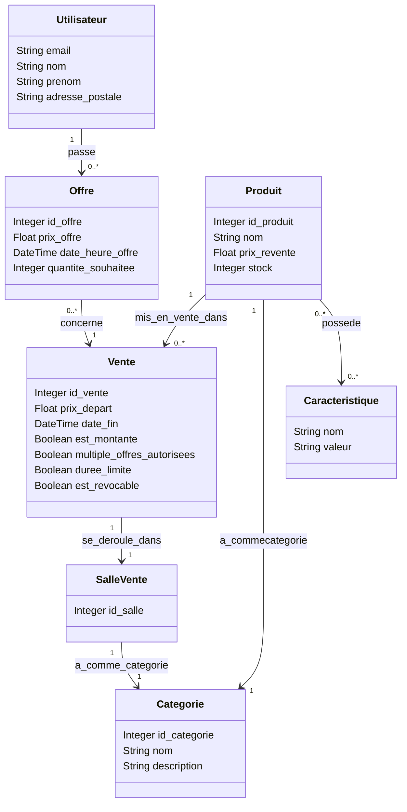

# Plateforme d'enchère

```mermaid
classDiagram
    class Offre {
        Integer id_offre
        Float prix_offre
        DateTime date_heure_offre
        Integer quantite_souhaitee
    }

    class Utilisateur {
        String email
        String nom
        String prenom
        String adresse_postale
    }

    class Vente {
        Integer id_vente
        Float prix_depart
        DateTime date_fin
        Boolean est_montante
        Boolean multiple_offres_autorisees
        Boolean duree_limite
        Boolean est_revocable
    }

    class SalleVente {
        Integer id_salle
    }

    class Produit {
        Integer id_produit
        String nom
        Float prix_revente
        Integer stock
    }

    class Categorie {
        Integer id_categorie
        String nom
        String description
    }

    class Caracteristique {
        String nom
        String valeur
    }

    Utilisateur "1" --> "0..*" Offre : passe
    Offre "0..*" --> "1" Vente : concerne
    Vente "1" --> "1" SalleVente : se_deroule_dans
    Produit "1" --> "0..*" Vente : mis_en_vente_dans
    Produit "1" --> "1" Categorie : a_commecategorie
    Produit "0..*" --> "0..*" Caracteristique : possede
    SalleVente "1" --> "1" Categorie : a_comme_categorie
```
