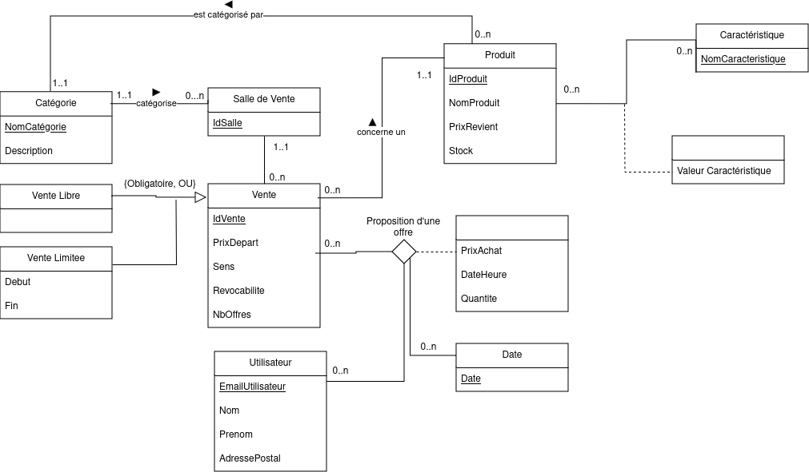

# Plateforme d'enchère
**Hélain Zimmermann, Abel Prud’homme Lacroix, Mateo Bedel, Nour El Hamidi, Nathan Guerin**


## Introduction
Ce document présente le compte rendu détaillé du projet de conception et de développement de notre plateforme d’enchères. Le projet a pour objectif de réaliser un système robuste, respectant les règles de normalisation des bases de données, tout en garantissant une interface homme-machine fonctionnelle et intuitive. Il s'agit de permettre à des utilisateurs d'interagir avec des ventes variées, d'y soumettre des offres, et de suivre le processus d'attribution des produits mis en enchère.

Le rapport est structuré de manière à couvrir les aspects fondamentaux du projet, depuis la modélisation conceptuelle et relationnelle des données jusqu’à la mise en œuvre technique des fonctionnalités principales. Nous avons pris soin de détailler les dépendances fonctionnelles, les contraintes contextuelles et les relations entre entités afin de proposer une solution à la fois complète et optimisée.

Nous aborderons également les choix de conception, les difficultés rencontrées, ainsi que les stratégies employées pour répondre aux contraintes fonctionnelles et non fonctionnelles. Ensuite, une attention particulière est portée sur l'analyse des fonctionnalités, les requêtes SQL mises en place, et l’organisation du travail au sein de l’équipe pour mener ce projet à bien.

Ce compte rendu vise à documenter non seulement le résultat final, mais aussi les apprentissages et les défis rencontrés lors du développement de la plateforme.

## Dépendences & contraintes

<table>
  <tr>
    <th style="border:1px solid">Dépendances Fonctionnelles</th>
    <th style="border:1px solid">Contraintes de Valeur</th>
    <th style="border:1px solid">Contraintes de Multiplicité</th>
    <th style="border:1px solid">Contraintes Contextuelles</th>
  </tr>
  <tr>
    <td style=" text-align: left; border:1px solid">
     EmailUtilisateur → {Nom, Prenom, AdressePostale} <br><br>
     IdProduit → {NomProduit, PrixRevient, Stock , NomCategorie} <br><br>
     NomCategorie → Description <br><br>
     {IdProduit, NomCaracteristique} → ValeurCaracteristique <br><br>
     IdSalle → {NomCategorie} <br><br>
     IdVente → {IdProduit, IdSalle, PrixDepart, Sens, NbOffres, Revocabilite} <br><br>
     IdVente → {Debut, Fin}<br><br>
     {EmailUtilisateur, IdVente, DateHeure} → {PrixAchat, Quantite}
    </td>
    <td style=" text-align: left;   border:1px solid">
     PrixRevient > 0 <br><br>
     PrixDepart > 0 <br><br>
     PrixAchat > 0 <br><br>
     Quantite > 0 <br><br>
     Fin > Debut <br><br>
     DateHeure > Debut <br><br>
     Quantite > Stock 
    </td>
    <td style=" text-align: left; border:1px solid">
     Email ↠ Offre <br><br>
     Produit ↠ caractéristique <br><br>
     Vente ↠ Offres <br><br>
     Salle ↠ Produit <br><br>
     Catégorie ↠ Produit  <br><br>
     Produit ↠ Vente <br><br>
     Vente → Salle <br><br>
     Vente → Produit  <br><br>
    </td>
    <td style=" text-align: left; border:1px solid">
     Une vente à durée libre implique un délai maximal de 10 minutes entre deux offres <br><br>
     Ventes par défaut : Montantes, Non révocables, Sans limite de temps, Permettant plusieurs enchères par utilisateur <br><br>
     Vente montante: Le prix d'achat doit être plus grand que le prix d'achat de l'offre précédente (et que le prix de départ si c'est la première offre) <br><br>
     Utilisateur: peut être limité à une offre uniquement, ou en faire autant qu'il veut 
    </td>
  </tr>
</table>

## Schéma entité-association 



### Justification

- Une vente se passe dans une salle de vente, d’où l’association.

- Une vente est soit une vente limitée possédant une date de fin ou de début, soit une vente libre n’en possédant pas. On crée alors une dépendance faible à vente pour garantir 1FN.

- Toutes les autres informations concernant le type de vente se trouve dans Vente.

- Une catégorie concerne une salle (car dans une salle on a des produits de la même catégorie) et donc un produit.

- Il est logique d'implémenter une association multiple entre offre, vente utilisateur et la date d’une offre. L’ajout de DateHeureOffre permet de garantir l’unicité de l’association, car un utilisateur peut faire plusieurs offres mais à des dates différentes.

- De même on implémente une association multiple entre caractéristique et produit qui donne une valeur. Plusieurs produits peuvent avoir une caractéristique , et un produit peut avoir plusieurs caractéristiques.

<br>

## Schéma Relationnel

### Implémentation, : 

_Produit_ : (**IdProduit**, NomProduit, PrixRevient, Stock, ...NomCategorie...)

_Salle de Vente_ : (**IdSalle**, ...NomCategorie...)

_Vente_ : (**IdVente**, PrixDepart, Sens, Revocabilité, NbOffres, ...IdSalle..., ...IdProduit...)

_Catégorie_ : (**NomCategorie**, Description)

_Offre_ : (...**EmailUtilisateur**..., ...**IdVente**..., ...**DateHeure**..., PrixAchat, Quantite)

_Date de l’offre_ : ( **DateHeure**)

_VenteLimite_ : (...**IdVente**..., DateDebut, DateFin)

_VenteLibre_ : (...**IdVente**...)

_Utilisateur_ : (**EmailUtilisateur**, Nom, Prenom, AdressePostale)

_Caracteristique_ : (**NomCaracteristique**)

_Valeur_Caracteristique_ : (...**IdProduit**..., ...**NomCaracteristique**..., Valeur Caracteristique)

### Légende des Clés : 
- **id** (Clef primaire)
- ...id... (Clef étrangère)


### Les formes normales des relations

- **Definition FN1:** Une relation est en première forme normale si tous les attributs possèdent tous une valeur sémantiquement atomique (une cellule ne peut pas avoir une table comme valeur). 

- **Definition FN2:** Une relation est en deuxième forme normale si un attribut non clef ne dépend pas d’une partie de la clef mais de toute la clef.

- **Definition FN3:** Une relation est en troisième forme normale si tous les attributs non clefs doivent dépendre directement de la clef, au sens où il n’y a aucun attribut non clef dépendant de la clef par dépendances transitives par l’intermédiaire d’autres attributs non clef.

- **Definition FN3BCK:** Une relation est en FN3BCK si tous les attributs non clefs ne sont pas source de dépendance fonctionnelle pour une partie de la clef. 

On remarque que toutes les relations de ce schéma relationnel sont bien FN1, les attributs possèdent bien tous une valeur atomique.


**Produit:**
- 1FN : Respectée, tous les attributs sont atomiques.
- 2FN : Respectée, car IdProduit est la clé primaire, et tous les 
attributs dépendent entièrement de cette clé.
- 3FN : Respectée, dans une catégorie il y a plusieurs produit.
- 3FNBCK : Respectée, il n'y a pas de dépendance transitive.

**Salle de vente:**
- 1FN : Respectée, les attributs sont atomiques.
- 2FN : Respectée, car IdSalle est la clé primaire, et tous les attributs dépendent uniquement de cette clé.
- 3FN : Respectée, car ils y a plusieurs salles qui ont la même catégorie. 
- 3FNBCK : Respectée, il n'y a pas de dépendance transitive.

**Vente:**
- 1FN : Respectée, tous les attributs sont atomiques.
- 2FN : Respectée, car IdVente est la clé primaire, et tous les attributs dépendent uniquement de cette clé.
- 3FN : Respectée, car dans une salle il y a plusieurs ventes et un produit peut être dans plusieurs ventes.
- 3FNBCK : Respectée, il n'y a pas de dépendance transitive.

**Catégorie:**
- 1FN : Respectée, les attributs sont atomiques.
- 2FN : Respectée, car NomCategorie est la clé primaire, et tous les attributs dépendent uniquement de cette clé.
- 3FN : Respectée, il n'y a pas de dépendance transitive.
- 3FNBCK : Respectée, il n'y a pas de dépendance transitive.

**Offre:**
- 1FN : Respectée, tous les attributs sont atomiques.
- 2FN : Respectée, car la clé primaire est (EmailUtilisateur, IdVente, DateHeureOffre), et tous les attributs dépendent entièrement de cette clé.
- 3FN : Respectée, il n'y a pas de dépendance transitive.
- 3FNBCK : Respectée, il n'y a pas de dépendance transitive.

**Date de l'offre:**
- 1FN : Respectée, l'attribut est atomique.
- 2FN : Respectée, car DateHeureOffre est la clé primaire.
- 3FN : Respectée, il n'y a pas de dépendance transitive.
- 3FNBCK : Respectée, il n'y a pas de dépendance transitive.

**VenteLimite:**
- 1FN : Respectée, tous les attributs sont atomiques.
- 2FN : Respectée, car IdVente est la clé primaire, et tous les attributs dépendent de cette clé.
- 3FN : Respectée, il n'y a pas de dépendance transitive.
- 3FNBCK : Respectée, il n'y a pas de dépendance transitive.

**VenteLibre:**
- 1FN : Respectée, l'attribut est atomique.
- 2FN : Respectée, car IdVente est la clé primaire.
- 3FN : Respectée, il n'y a pas de dépendance transitive.
- 3FNBCK : Respectée, il n'y a pas de dépendance transitive.

**Utilisateur:**
- 1FN : Respectée, tous les attributs sont atomiques.
 -2FN : Respectée, car EmailUtilisateur est la clé primaire, et tous les attributs dépendent uniquement de cette clé.
- 3FN : Respectée, il n'y a pas de dépendance transitive.
- 3FNBCK : Respectée, il n'y a pas de dépendance transitive.

**Caracteristique:**
- 1FN : Respectée, l'attribut est atomique.
- 2FN : Respectée, car NomCaracteristique est la clé primaire.
- 3FN : Respectée, il n'y a pas de dépendance transitive.
- 3FNBCK : Respectée, il n'y a pas de dépendance transitive.

**Valeur caracteristique:**
- 1FN : Respectée, tous les attributs sont atomiques.
- 2FN : Respectée, car la clé primaire est (IdProduit, NomCaracteristique), et tous les attributs dépendent entièrement de cette clé.
- 3FN : Respectée, il n'y a pas de dépendance transitive.
- 3FNBCK : Respectée, il n'y a pas de dépendance transitive.


## Interface Homme Machine

### Analyse des fonctionnalités


### Mode d'emploi

Pour utiliser notre interface homme-machine, il suffit d'exécuter la commande make dans votre terminal. Vous aurez alors accès à toutes les fonctionnalités visibles dans le schéma précédent. Vos choix devront être effectués directement dans le terminal en entrant l'option souhaitée parmi celles proposées.

### Les requêtes SQL2

```SQL
---------------- REQUETES RELATIVES AUX CATEFORIES ----------------

-- Liste les noms de toutes les catégories
SELECT NomCategorie FROM Categorie;

-- Vérifie si une catégorie donnée existe
-- Renvoi 1 si la catégorie existe, sinon renvoi VIDE
SELECT 1 FROM Categorie WHERE NomCategorie = <NOM_CATEGORIE>;

---------------- REQUETES RELATIVES AUX SALLES DE VENTE ----------------

-- Récupère l'ID de la salle de vente avec l'ID le plus élevé
-- Renvoi l'ID de la dernière salle de vente ajoutée
SELECT IdSalle FROM SalleDeVente ORDER BY IdSalle DESC FETCH FIRST 1 ROWS ONLY;

-- Récupère les informations des ventes d'une salle spécifique
-- Renvoi les détails de la vente (IdVente, Sens, Revocabilite, NbOffres) pour une salle donnée
SELECT IdVente, Sens, Revocabilite, NbOffres 
FROM Vente 
WHERE IdSalle = <ID_SALLE>;

-- Récupère l'ID et la catégorie d'une salle
-- Renvoi l'ID et la catégorie (NomCategorie) de toutes les salles de vente
SELECT IdSalle, NomCategorie FROM SalleDeVente;

-- Vérifie si une salle de vente avec un ID donné existe
-- Renvoi 1 si la salle de vente existe, sinon renvoi VIDE
SELECT 1 FROM SalleDeVente WHERE IdSalle = <ID_SALLE>;

-- Insère une nouvelle salle de vente avec une catégorie donnée
-- Ajoute une nouvelle salle de vente avec l'ID et la catégorie spécifiés
INSERT INTO SalleDeVente (IdSalle, NomCategorie) VALUES (<ID_SALLE>, <NOM_CATEGORIE>);

---------------- REQUETES RELATIVES AUX PRODUITS ----------------

-- Récupère l'ID du produit avec l'ID le plus élevé
-- Renvoi l'ID du dernier produit ajouté à la base de données
SELECT IdProduit FROM Produit ORDER BY IdProduit DESC FETCH FIRST 1 ROWS ONLY;

-- Insère un nouveau produit avec les détails fournis
-- Ajoute un produit avec l'ID, nom, prix de revient, stock et catégorie fournis
INSERT INTO Produit (IdProduit, NomProduit, PrixRevient, Stock, NomCategorie) VALUES (<ID_PRODUIT>, <NOM_PRODUIT>, <PRIX_REVIENT>, <STOCK>, <NOM_CATEGORIE>);

---------------- REQUETES RELATIVES AUX OFFRES ----------------

-- Récupère le prix de départ et le stock du produit associé à une vente donnée
-- Renvoi le prix de départ et le stock du produit pour la vente spécifiée
SELECT PrixDepart, Stock 
FROM Vente, Produit 
WHERE Vente.IdProduit = Produit.IdProduit 
  AND IdVente = <ID_VENTE>;

-- Récupère le prix d'achat maximum pour une vente donnée
-- Renvoi le prix d'achat le plus élevé pour la vente spécifiée
SELECT MAX(PrixAchat) 
FROM Offre 
WHERE IdVente = <ID_VENTE>;

-- Récupère les informations sur l'utilisateur ayant proposé le prix d'achat maximum pour une vente donnée
-- Renvoi l'email de l'utilisateur et le prix d'achat maximum pour la vente spécifiée
SELECT EmailUtilisateur, PrixAchat 
FROM Offre 
WHERE IdVente = <ID_VENTE> 
  AND PrixAchat = (SELECT MAX(PrixAchat) FROM Offre WHERE IdVente = <ID_VENTE>);

-- Récupère la date et l'heure de l'offre avec le prix d'achat maximum pour une vente donnée
-- Renvoi la date et l'heure de l'offre ayant le prix d'achat maximum pour la vente spécifiée
SELECT DateHeureOffre 
FROM Offre 
WHERE IdVente = <ID_VENTE> 
  AND PrixAchat = (SELECT MAX(PrixAchat) FROM Offre WHERE IdVente = <ID_VENTE>);

-- Récupère le nombre d'offres pour une vente donnée
-- Renvoi le nombre total d'offres pour la vente spécifiée
SELECT COUNT(*) FROM Vente WHERE IdVente = <ID_VENTE>;

-- Insère une nouvelle date pour une offre
-- Ajoute une nouvelle date d'offre avec la date et l'heure spécifiées
INSERT INTO DateOffre (DateHeureOffre) VALUES (<DATE_HEURE_OFFER>);

-- Insère une nouvelle offre avec les détails fournis
-- Ajoute une nouvelle offre avec le prix d'achat, la quantité, l'ID de la vente, l'email de l'utilisateur et la date et l'heure de l'offre
INSERT INTO Offre (PrixAchat, QuantiteOffre, IdVente, EmailUtilisateur, DATEHEUREOFFRE) VALUES (<PRIX_ACHAT>, <QUANTITE_OFFER>, <ID_VENTE>, <EMAIL_UTILISATEUR>, <DATE_HEURE_OFFER>);

-- Vérifie si un utilisateur existe
-- Renvoi 1 si l'utilisateur avec l'email donné existe, sinon renvoi VIDE
SELECT 1 FROM Utilisateur WHERE EmailUtilisateur = <EMAIL_UTILISATEUR>;

---------------- REQUETES RELATIVES AUX VENTES ----------------

-- Vérifie si une vente avec un ID donné existe
-- Renvoi 1 si la vente existe, sinon renvoi VIDE
SELECT 1 FROM Vente WHERE IdVente = <ID_VENTE>;

-- Récupère les informations des ventes pour une salle donnée
-- Renvoi les détails des ventes (IdVente, NomProduit, Stock, PrixDepart) pour la salle spécifiée
SELECT IdVente, NomProduit, Stock, PrixDepart 
FROM Vente, Produit 
WHERE Vente.IdProduit = Produit.IdProduit 
  AND IdSalle = <ID_SALLE>;

-- Récupère l'ID de la vente avec l'ID le plus élevé
-- Renvoi l'ID de la dernière vente ajoutée à la base de données
SELECT IdVente FROM Vente ORDER BY IdVente DESC FETCH FIRST 1 ROWS ONLY;

-- Insère une nouvelle vente avec les détails fournis
-- Ajoute une nouvelle vente avec les détails spécifiés (prix de départ, sens, revocabilité, etc.)
INSERT INTO Vente (IdVente, PrixDepart, Sens, Revocabilite, NbOffres, IdSalle, IdProduit) VALUES (<ID_VENTE>, <PRIX_DEPART>, <SENS>, <REVOCABILITE>, <NB_OFFRES>, <ID_SALLE>, <ID_PRODUIT>);

-- Insère une vente limitée avec ses dates de début et de fin
-- Ajoute une nouvelle vente limitée avec la date de début et de fin spécifiées
INSERT INTO VenteLimite (IdVente, DateDebut, DateFin) VALUES (<ID_VENTE>, <DATE_DEBUT>, <DATE_FIN>);

-- Insère une vente libre
-- Ajoute une vente libre pour l'ID de vente spécifié
INSERT INTO VenteLibre (IdVente) VALUES (<ID_VENTE>);

-- Vérifie si une vente est limitée ou libre
-- Renvoi 1 si la vente est limitée, sinon 0
SELECT CASE 
       WHEN vlim.IdVente IS NOT NULL THEN 1 
       ELSE 0 
       END AS isLimitee 
FROM Vente v 
LEFT JOIN VenteLimite vlim ON v.IdVente = vlim.IdVente 
WHERE v.IdVente = <ID_VENTE>;

-- Récupère la date de début d'une vente limitée
-- Renvoi la date de début de la vente limitée spécifiée
SELECT DateDebut FROM VenteLimite WHERE IdVente = <ID_VENTE>;

-- Récupère la date de fin d'une vente limitée
-- Renvoi la date de fin de la vente limitée spécifiée
SELECT DateFin FROM VenteLimite WHERE IdVente = <ID_VENTE>;

```

## Bilan 

### Points Difficiles Rencontrés

- Compréhension du Sujet : La compréhension du sujet a été un des principaux défis, car il a fallu clarifier certaines attentes avant de pouvoir avancer efficacement.

- Choix de Conception : Le choix des bonnes solutions de conception a été complexe, notamment pour définir les relations entre les différentes entités et s'assurer qu'elles respectent les contraintes d'intégrité et de normalisation. 

- Accès Concurrent pour l'Interface Homme-Machine : Gérer les accès concurrents dans l'interface homme-machine a été un autre point difficile. Il a fallu s'assurer que plusieurs utilisateurs pouvaient interagir avec le système sans conflit, en particulier lors de la gestion des ventes et des offres.

### Organisation du Travail

- Conception, schema relationel : Nous avons tous travaillé ensemble sur cette partie au début du projet.

- Interface Homme-Machine: Abel et Nour ont été impliqués dès le début du projet. Par la suite, Mateo et Hélain ont rejoint cette tâche une fois que les autres parties étaient terminées, tandis qu'Abel est allé se concentrer sur le compte rendu.

- Requêtes SQL: Nathan a pris en charge cette tâche dès le début, en se concentrant sur la création des requêtes nécessaires au projet.

- Implémentation des Tables et Données de Base: Mateo et Hélain ont travaillé sur la mise en place des tables et l'intégration des données de base.


