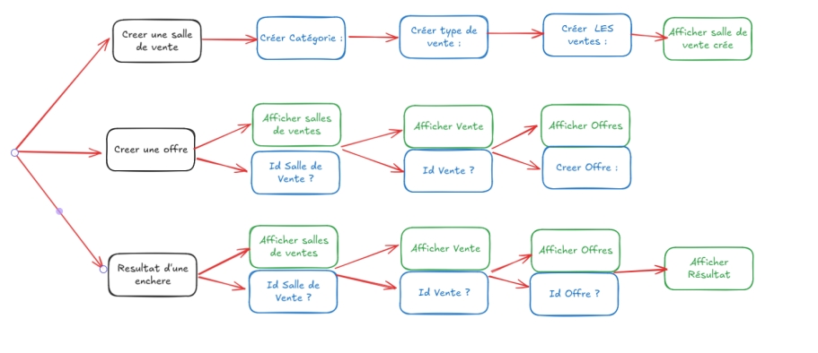

# Plateforme d'enchère

## Dépendences & contraintes

<table>
  <tr>
    <th style="border:1px solid">Dépendances Fonctionnelles</th>
    <th style="border:1px solid">Contraintes de Valeur</th>
    <th style="border:1px solid">Contraintes de Multiplicité</th>
    <th style="border:1px solid">Contraintes Contextuelles</th>
  </tr>
  <tr>
    <td style=" text-align: left; border:1px solid">
     EmailUtilisateur → {Nom, Prenom, AdressePostale} <br><br>
     IdProduit → {NomProduit, PrixRevient, Stock , NomCategorie} <br><br>
     NomCategorie → Description <br><br>
     {IdProduit, NomCaracteristique} → ValeurCaracteristique <br><br>
     IdSalle → {NomCategorie} <br><br>
     IdVente → {IdProduit, IdSalle, PrixDepart, Sens, NbOffres, Revocabilite} <br><br>
     IdVente → {Debut, Fin}<br><br>
     {EmailUtilisateur, IdVente, DateHeure} → {PrixAchat, Quantite}
    </td>
    <td style=" text-align: left;   border:1px solid">
     PrixRevient > 0 <br><br>
     PrixDepart > 0 <br><br>
     PrixAchat > 0 <br><br>
     Quantite > 0 <br><br>
     Fin > Debut
    </td>
    <td style=" text-align: left; border:1px solid">
     Un email peut avoir plusieurs offres ↠ <br><br>
     Un produit peut avoir plusieurs caractéristiques ↠ <br><br>
     Une vente peut avoir plusieurs offres ↠ <br><br>
     Une salle peut contenir plusieurs produits ↠ <br><br>
     Une catégorie peut avoir plusieurs produits ↠ <br><br>
     Un produit peut être dans plusieurs ventes ↠ <br><br>
     Une vente n'a lieu que dans une seule salle <br><br>
     Une vente ne concerne qu'un seul produit  <br><br>
     Une vente n'a lieu que dans une seule salle  <br><br>
    </td>
    <td style=" text-align: left; border:1px solid">
     Une vente à durée libre implique un délai maximal de 10 minutes entre deux offres <br><br>
     Ventes par défaut : Montantes, Non révocables, Sans limite de temps, Permettant plusieurs enchères par utilisateur
    </td>
  </tr>
</table>

## Schéma entité-association 


### Justification

- Une vente se passe dans une salle de vente, d’où l’association.

- Une vente est soit une vente limitée possédant une date de fin ou de début, soit une vente libre n’en possédant pas. On crée alors une dépendance faible à vente pour garantir 1FN.

- Toutes les autres informations concernant le type de vente se trouve dans Vente.

- Une catégorie concerne une salle (car dans une salle on a des produits de la même catégorie) et donc un produit.

- Il est logique d'implémenter une association multiple entre offre, vente utilisateur et la date d’une offre. L’ajout de DateHeureOffre permet de garantir l’unicité de l’association, car un utilisateur peut faire plusieurs offres mais à des dates différentes.

- De même on implémente une association multiple entre caractéristique et produit qui donne une valeur. Plusieurs produits peuvent avoir une caractéristique , et un produit peut avoir plusieurs caractéristiques.

<br>

## Schéma Relationnel

### Implémentation, : 

_Produit_ : (**IdProduit**, NomProduit, PrixRevient, Stock, ...NomCategorie...)

_Salle de Vente_ : (**IdSalle**, ...NomCategorie...)

_Vente_ : (**IdVente**, PrixDepart, Sens, Revocabilité, NbOffres, ...IdSalle..., ...IdProduit...)

_Catégorie_ : (**NomCategorie**, Description)

_Offre_ : (...**EmailUtilisateur**..., ...**IdVente**..., ...**DateHeure**..., PrixAchat, Quantite)

_Date de l’offre_ : ( **DateHeure**)

_VenteLimite_ : (...**IdVente**..., DateDebut, DateFin)

_VenteLibre_ : (...**IdVente**...)

_Utilisateur_ : (**EmailUtilisateur**, Nom, Prenom, AdressePostale)

_Caracteristique_ : (**NomCaracteristique**)

_Valeur_Caracteristique_ : (...**IdProduit**..., ...**NomCaracteristique**..., Valeur Caracteristique)

### Légende des Clés : 
- **id** (Clef primaire)
- ...id... (Clef étrangère)


### Les formes normales des relations

- **Definition FN1:** Une relation est en première forme normale si tous les attributs possèdent tous une valeur sémantiquement atomique (une cellule ne peut pas avoir une table comme valeur). 

- **Definition FN2:** Une relation est en deuxième forme normale si un attribut non clef ne dépend pas d’une partie de la clef mais de toute la clef.

- **Definition FN3:** Une relation est en troisième forme normale si tous les attributs non clefs doivent dépendre directement de la clef, au sens où il n’y a aucun attribut non clef dépendant de la clef par dépendances transitives par l’intermédiaire d’autres attributs non clef.

- **Definition FN3BCK:** Une relation est en FN3BCK si tous les attributs non clefs ne sont pas source de dépendance fonctionnelle pour une partie de la clef. 

On remarque que toutes les relations de ce schéma relationnel sont bien FN1, les attributs possèdent bien tous une valeur atomique.


**Produit:**
- 1FN : Respectée, tous les attributs sont atomiques.
- 2FN : Respectée, car IdProduit est la clé primaire, et tous les 
attributs dépendent entièrement de cette clé.
- 3FN : Respectée, dans une catégorie il y a plusieurs produit.
- 3FNBCK : Respectée, il n'y a pas de dépendance transitive.

**Salle de vente:**
- 1FN : Respectée, les attributs sont atomiques.
- 2FN : Respectée, car IdSalle est la clé primaire, et tous les attributs dépendent uniquement de cette clé.
- 3FN : Respectée, car ils y a plusieurs salles qui ont la même catégorie. 
- 3FNBCK : Respectée, il n'y a pas de dépendance transitive.

**Vente:**
- 1FN : Respectée, tous les attributs sont atomiques.
- 2FN : Respectée, car IdVente est la clé primaire, et tous les attributs dépendent uniquement de cette clé.
- 3FN : Respectée, car dans une salle il y a plusieurs ventes et un produit peut être dans plusieurs ventes.
- 3FNBCK : Respectée, il n'y a pas de dépendance transitive.

**Catégorie:**
- 1FN : Respectée, les attributs sont atomiques.
- 2FN : Respectée, car NomCategorie est la clé primaire, et tous les attributs dépendent uniquement de cette clé.
- 3FN : Respectée, il n'y a pas de dépendance transitive.
- 3FNBCK : Respectée, il n'y a pas de dépendance transitive.

**Offre:**
- 1FN : Respectée, tous les attributs sont atomiques.
- 2FN : Respectée, car la clé primaire est (EmailUtilisateur, IdVente, DateHeureOffre), et tous les attributs dépendent entièrement de cette clé.
- 3FN : Respectée, il n'y a pas de dépendance transitive.
- 3FNBCK : Respectée, il n'y a pas de dépendance transitive.

**Date de l'offre:**
- 1FN : Respectée, l'attribut est atomique.
- 2FN : Respectée, car DateHeureOffre est la clé primaire.
- 3FN : Respectée, il n'y a pas de dépendance transitive.
- 3FNBCK : Respectée, il n'y a pas de dépendance transitive.

**VenteLimite:**
- 1FN : Respectée, tous les attributs sont atomiques.
- 2FN : Respectée, car IdVente est la clé primaire, et tous les attributs dépendent de cette clé.
- 3FN : Respectée, il n'y a pas de dépendance transitive.
- 3FNBCK : Respectée, il n'y a pas de dépendance transitive.

**VenteLibre:**
- 1FN : Respectée, l'attribut est atomique.
- 2FN : Respectée, car IdVente est la clé primaire.
- 3FN : Respectée, il n'y a pas de dépendance transitive.
- 3FNBCK : Respectée, il n'y a pas de dépendance transitive.

**Utilisateur:**
- 1FN : Respectée, tous les attributs sont atomiques.
 -2FN : Respectée, car EmailUtilisateur est la clé primaire, et tous les attributs dépendent uniquement de cette clé.
- 3FN : Respectée, il n'y a pas de dépendance transitive.
- 3FNBCK : Respectée, il n'y a pas de dépendance transitive.

**Caracteristique:**
- 1FN : Respectée, l'attribut est atomique.
- 2FN : Respectée, car NomCaracteristique est la clé primaire.
- 3FN : Respectée, il n'y a pas de dépendance transitive.
- 3FNBCK : Respectée, il n'y a pas de dépendance transitive.

**Valeur caracteristique:**
- 1FN : Respectée, tous les attributs sont atomiques.
- 2FN : Respectée, car la clé primaire est (IdProduit, NomCaracteristique), et tous les attributs dépendent entièrement de cette clé.
- 3FN : Respectée, il n'y a pas de dépendance transitive.
- 3FNBCK : Respectée, il n'y a pas de dépendance transitive.


## Interface Homme Machine

### Analyse des fonctionnalités



### Mode d'emploi

Pour utiliser notre interface homme-machine, il suffit d'exécuter la commande make dans votre terminal. Vous aurez alors accès à toutes les fonctionnalités visibles dans le schéma précédent. Vos choix devront être effectués directement dans le terminal en entrant l'option souhaitée parmi celles proposées.

### Les requêtes SQL2

```SQL
---------------- SALLE DE VENTE ----------------

-- REGARDER SI UN PRODUIT (<ID_PRODUIT>) A LA MEME CATEGORIE D'UNE SALLE (<ID_SALLE>)
-- Renvoi PRODUIT | SALLE, si le produit à la meme categorie que la salle sinon renvoi VIDE

SELECT 
    p.IdProduit, 
    p.NomProduit, 
    s.IdSalle
FROM Produit p
JOIN SalleDeVente s ON p.NomCategorie = s.NomCategorie
WHERE p.IdProduit = <ID_PRODUIT>
AND s.IdSalle = <ID_SALLE>;


-- REGARDER SI UNE NOUVELLE VENTE A LE MEME TYPE DE VENTE QUE LES VENTES D'UNE SALLE
-- UNE VENTE (<SENS_DE_LA_VENTE>, <REVOCABILITE_DE_LA_VENTE>, <NOMBRE_OFFRES_DE_LA_VENTE>, <LIMTE_VENTE>) 
-- <LIMTE_VENTE> doit valoir 'VenteLimitee' ou 'VenteLibre'
-- Renvoi les ventes de salle si la nouvelle vente à le bon type sinon VIDE

SELECT 
    v.IdVente,
    v.Sens,
    v.Revocabilite,
    v.NbOffres
FROM Vente v
WHERE v.IdSalle = <ID_DE_LA_SALLE>
  AND v.Sens = <SENS_DE_LA_VENTE>
  AND v.Revocabilite = <REVOCABILITE_DE_LA_VENTE>
  AND v.NbOffres = <NOMBRE_OFFRES_DE_LA_VENTE>
  AND (
      -- Vérifie que toutes les ventes de la salle sont du même type que la nouvelle vente
      (EXISTS (SELECT 1 FROM VenteLimite vl WHERE vl.IdVente = v.IdVente) 
       AND <LIMTE_VENTE> = 'VenteLimitee')
      OR
      (EXISTS (SELECT 1 FROM VenteLibre vl WHERE vl.IdVente = v.IdVente) 
       AND <LIMTE_VENTE> = 'VenteLibre')
  );

---------------- FAIRE UNE OFFRE ----------------


-- VÉRIFIER QUE LE PRIX DE LA PREMIÈRE OFFRE D'UNE VENTE MONTANTE EST SUPÉRIEUR AU PRIX DE DÉPART
-- Cette requête garantit que la première offre faite dans une vente montante
-- est supérieure au prix de départ défini pour cette vente.

SELECT COUNT(*) AS OffreValide
FROM Offre
JOIN Vente ON Offre.IdVente = Vente.IdVente
WHERE Offre.IdVente = :idVente
AND Offre.EmailUtilisateur = :emailUtilisateur
AND Offre.PrixAchat > Vente.PrixDepart;


-- RÉCUPÉRER LA DERNIÈRE OFFRE D'UNE VENTE (MONTANTE) SPÉCIFIQUE
-- Cette requête sert à vérifier si une nouvelle offre est valide dans une vente montante.
-- Une vente montante impose que chaque nouvelle offre soit supérieure à la dernière offre.
-- Elle extrait la dernière offre enregistrée et son prix d'achat associé pour une vente donnée,
-- afin de les comparer avec les détails de l'offre proposée.

SELECT Offre.DateHeureOffre, Offre.PrixAchat
FROM Offre
JOIN Vente ON Offre.IdVente = Vente.IdVente
JOIN DateOffre ON Offre.DateHeureOffre = DateOffre.DateHeureOffre
WHERE Vente.IdVente = :idVente
ORDER BY DateOffre.DateHeureOffre DESC
FETCH FIRST ROW ONLY;


-- VÉRIFIER QUE L'OFFRE A ÉTÉ EFFECTUÉE AVANT LA DATE DE FIN POUR UNE VENTE À DURÉE LIMITÉE
-- Cette requête s'assure que l'offre a été soumise avant la date limite spécifiée pour une vente limitée.
-- Si l'offre est valide (effectuée avant la date de fin), elle est comptabilisée.

SELECT COUNT(*) AS OffreValide
FROM Offre
JOIN Vente ON Offre.IdVente = Vente.IdVente
JOIN VenteLimite ON Vente.IdVente = VenteLimite.IdVente
JOIN DateOffre ON DateOffre.DateHeureOffre = Offre.DateHeureOffre
WHERE Offre.IdVente = :idVente
AND DateOffre.DateHeureOffre = :dateOffre
AND Offre.DateHeureOffre <= VenteLimite.DateFin;


-- COMPTER LE NOMBRE D'OFFRES D'UN UTILISATEUR POUR UNE VENTE À OFFRES LIMITÉES
-- Cette requête permet de vérifier si un utilisateur a déjà atteint la limite d'offres autorisées
-- pour une vente où le nombre d'offres par utilisateur est restreint.
-- Si l'utilisateur a déjà soumis une offre pour cette vente, une nouvelle offre ne sera pas acceptée.

SELECT COUNT(*) AS NombreOffres
FROM Offre
WHERE Offre.EmailUtilisateur = :emailUtilisateur
AND Offre.IdVente = :idVente;


-- VÉRIFIER SI UNE VENTE DESCENDANTE DOIT ÊTRE FERMÉE AVEC UNE SEULE OFFRE
-- Dans une vente descendante, si une seule offre est effectuée, la vente est automatiquement fermée.
-- Cette requête permet de compter le nombre d'offres effectuées pour une vente descendante spécifique.

SELECT COUNT(*) AS VenteFermee
FROM Offre
JOIN Vente ON Offre.IdVente = Vente.IdVente
WHERE Offre.IdVente = :idVente
AND Vente.Sens = 'decroissant';


---------------- RÉCUPÉRER Le GAGNANT D'UNE VENTE MONTANTE ----------------

-- RÉCUPÉRER LE GAGNANT UNE VENTE MONTANTE À DURÉE LIBRE ET NON RÉVOCABLE
-- Cette requête extrait la dernière offre effectuée dans une vente à durée
-- libre et non révocable.

SELECT Offre.*
FROM Offre
JOIN Vente ON Offre.IdVente = Vente.IdVente
JOIN VenteLibre ON Vente.IdVente = VenteLibre.IdVente
WHERE Vente.Sens = 'croissant'
AND Vente.Revocabilite = 0
AND Vente.IdVente = :idVente
ORDER BY Offre.DateHeureOffre DESC
FETCH FIRST ROW ONLY;


-- RÉCUPÉRER LE GAGNANT D'UNE VENTE MONTANTE À DURÉE FIXE ET NON RÉVOCABLE
-- Cette requête extrait la dernière offre effectuée avant la date de fin 
-- dans une vente montante non révocable

SELECT Offre.*
FROM Offre
JOIN Vente ON Offre.IdVente = Vente.IdVente
JOIN VenteLimite ON Vente.IdVente = VenteLimite.IdVente
WHERE Vente.Sens = 'croissant'
AND Vente.Revocabilite = 0
AND Vente.IdVente = :idVente
AND VenteLimite.DateFin > Offre.DateHeureOffre
ORDER BY Offre.DateHeureOffre DESC
FETCH FIRST ROW ONLY;


-- RÉCUPÉRER LE GAGANT D'UNE VENTE MONTANTE À DURÉE LIBRE ET RÉVOCABLE
-- Cette requête extrait la dernière offre effectuée et évalue si elle doit être révoquée
-- en comparant son prix d'achat au prix de revient du produit associé.

SELECT Offre.EmailUtilisateur, Offre.PrixAchat, Produit.PrixRevient,
  CASE 
    WHEN o.PrixAchat < p.PrixRevient THEN 'Révoquer'
    ELSE 'Conserver'
  END AS StatutVente
FROM Offre
JOIN Vente ON Offre.IdVente = Vente.IdVente
JOIN Produit ON Vente.IdProduit = Produit.IdProduit
JOIN VenteLibre ON Vente.IdVente = VenteLibre.IdVente
WHERE Vente.Sens = 'croissant'
AND Vente.Revocabilite = 1
AND Vente.IdVente = :idVente
ORDER BY Offre.DateHeureOffre DESC, Offre.PrixAchat DESC
FETCH FIRST ROW ONLY;


-- RÉCUPÉRER LE GAGNANT D'UNE VENTE MONTANTE À DURÉE FIXE ET RÉVOCABLE
-- Cette requête identifie la meilleure offre soumise avant la date de fin
-- dans une vente descendante révocable, et détermine si elle doit être révoquée.

SELECT Offre.EmailUtilisateur, Offre.PrixAchat, Produit.PrixRevient,
  CASE 
    WHEN Offre.PrixAchat < Produit.PrixRevient THEN 'Révoquer'
    ELSE 'Conserver'
  END AS StatutVente
FROM Offre
JOIN Vente ON Offre.IdVente = Vente.IdVente
JOIN Produit ON Vente.IdProduit = Produit.IdProduit
JOIN VenteLimite ON Vente.IdVente = VenteLimite.IdVente
WHERE Vente.Sens = 'croissant'
AND Vente.Revocabilite = 1
AND Vente.IdVente = :idVente
AND VenteLimite.DateFin > Offre.DateHeureOffre
ORDER BY Offre.DateHeureOffre DESC
FETCH FIRST ROW ONLY;


---------------- RÉCUPÉRER Le GAGNANT D'UNE VENTE DESCENDANTE ----------------

-- RÉCUPÉRER Le GAGNANT D'UNE VENTE DESCENDANTE À DURÉE LIBRE ET NON RÉVOCABLE
-- Cette requête identifie la première offre soumise dans une vente descendante
-- où la durée est illimitée et les offres ne peuvent pas être révoquées.

SELECT Offre.*
FROM Offre
JOIN Vente ON Offre.IdVente = Vente.IdVente
JOIN VenteLibre ON Vente.IdVente = VenteLibre.IdVente
WHERE Vente.Sens = 'decroissant'
AND Vente.Revocabilite = 0
AND Vente.IdVente = :idVente
ORDER BY Offre.DateHeureOffre ASC
FETCH FIRST ROW ONLY;


-- RÉCUPÉRER LE GAGNANT D'UNE VENTE DESCENDANTE À DURÉE FIXE ET NON RÉVOCABLE
-- Cette requête identifie la première offre soumise avant la date de fin 
-- dans une vente descendante où les offres ne peuvent pas être révoquées.

SELECT Offre.*
FROM Offre
JOIN Vente ON Offre.IdVente = Vente.IdVente
JOIN VenteLimite ON Vente.IdVente = VenteLimite.IdVente
WHERE Vente.Sens = 'decroissant'
AND Vente.Revocabilite = 0
AND Vente.IdVente = :idVente
AND VenteLimite.DateFin > Offre.DateHeureOffre
ORDER BY Offre.DateHeureOffre ASC
FETCH FIRST ROW ONLY;


-- RÉCUPÉRER LE GAGNANT POUR UNE VENTE DESCENDANTE À DURÉE LIBRE ET RÉVOCABLE
-- Cette requête extrait la première offre soumise dans une vente descendante révocable
-- et détermine si elle doit être conservée ou révoquée en fonction de son prix.

SELECT Offre.EmailUtilisateur, Offre.PrixAchat, Produit.PrixRevient,
  CASE 
    WHEN Offre.PrixAchat < Produit.PrixRevient THEN 'Révoquer'
    ELSE 'Conserver'
  END AS StatutVente
FROM Offre
JOIN Vente ON Offre.IdVente = Vente.IdVente
JOIN Produit ON Vente.IdProduit = Produit.IdProduit
JOIN VenteLibre ON Vente.IdVente = VenteLibre.IdVente
WHERE Vente.Sens = 'decroissant'
AND Vente.Revocabilite = 1
AND Vente.IdVente = :idVente
ORDER BY Offre.DateHeureOffre ASC, Offre.PrixAchat ASC
FETCH FIRST ROW ONLY;


-- RÉCUPÉRER LE GAGNANT D'UNE VENTE DESCENDANTE À DURÉE FIXE ET RÉVOCABLE
-- Cette requête identifie la première offre soumise avant la date de fin
-- dans une vente descendante révocable et détermine si elle doit être conservée ou révoquée.

SELECT Offre.EmailUtilisateur, Offre.PrixAchat, Produit.PrixRevient,
  CASE 
    WHEN Offre.PrixAchat < Produit.PrixRevient THEN 'Révoquer'
    ELSE 'Conserver'
  END AS StatutVente
FROM Offre
JOIN Vente ON Offre.IdVente = Vente.IdVente
JOIN Produit ON Vente.IdProduit = Produit.IdProduit
JOIN VenteLimite ON Vente.IdVente = VenteLimite.IdVente
WHERE Vente.Sens = 'decroissant'
AND Vente.Revocabilite = 1
AND Vente.IdVente = :idVente
AND VenteLimite.DateFin > Offre.DateHeureOffre
ORDER BY Offre.DateHeureOffre ASC
FETCH FIRST ROW ONLY;
```


